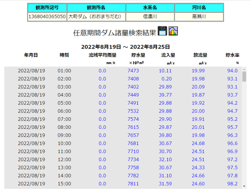
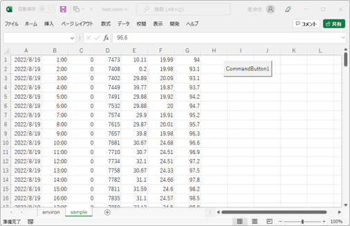

# SeleniumVBA

[SeleniumVBA](https://github.com/GCuser99/SeleniumVBA) は VBA 用の [Selenium](https://www.selenium.dev/ja/documentation/) バインディング<sup> (1) </sup>であり、[植木悠二氏](https://twitter.com/uezochan)が開発した [TinySeleniumVBA](https://github.com/uezo/TinySeleniumVBA/) を [Mike GCUser99](https://github.com/GCuser99) が拡張したものである。

```sample.xlsm``` は、SeleniumVBA を利用して、[水文・水質データベース](http://www1.river.go.jp/)から大町ダムの 2022 年 8 月 19 日から 25 日までのダム諸量を抽出する Excel のマクロ付きのワークブックであり、起動時に最新の SeleniumVBA と Chrome のバージョンに対応する WebDriver をインストールする<sup> (2) </sup>仕様になっている。

ユーザーはこのワークブックをテンプレートとして独自のアプリケーションを開発することが出来る。
ただし、SeleniumVBA の理解が進んでいない段階では ThisWorkbook.cls と environ ワークシートに手を触れない方が無難である。

<span style="font-size: small">
（1）VBA で Web ブラウザと交信する <a href="https://www.selenium.dev/ja/documentation/webdriver/">WebDriver</a> のライブラリを操作する。

（2）社内で利用する際にはプロキシサーバーのパスワードの入力を求められることがある（python、curl 等でプロキシ用の設定がされている場合はそれに従う）。
</span>

<div align="center">
&nbsp;&nbsp;

</div>

## Requirement

* **Chrome**
* **Microsoft Excel**

    Excel は以下の通り設定する必要がある。

    

    

## Example

### Web Contents (main)
```html
<HTML>
<HEAD>…</HEAD>
<BODY …>
<CENTER>
<TABLE …>…</TABLE>
<P …><FONT …>任意期間ダム諸量検索結果</FONT>
<A href=“csv 表示用のページの URL" target="_blank">…</A>
<A href=“グラフ表示用のページの URL" TARGET="_blank">…</A>
<P …><FONT …><B>2022年8月19日 ～ 2022年8月25日</B></FONT>
<TABLE …>…</TABLE>
<IFRAME src="/html/frm/DamFreeData2022090506084732419.html" …></IFRAME>
</CENTER></BODY></HTML>
```

### Web Contents (iframe)
```html
<HTML>
<HEAD>…</HEAD>
<BODY …>
<DIV …>
<CENTER>
<TABLE …>
  <TBODY>
    <TR>
      <TD …>2022/08/19</TD>
      <TD …>01:00</TD>
      <TD …><FONT …>0.0</FONT></TD>
      <TD …><FONT …>7473</FONT></TD>
      <TD …><FONT …>10.11</FONT></TD>
      <TD …><FONT …>19.99</FONT></TD>
      <TD …><FONT …>94.0</FONT></TD>
    </TR>
    <TR>…</TR> <TR>…</TR>…<TR>…</TR> <TR>…</TR>
</TBODY> </TABLE></CENTER></DIV></BODY></HTML>
```

### VBA (CommandButton1_Click)
```vbnet
Dim driver As New WebDriver ‘WebCriver クラスのオブジェクト
driverPath = shtEnviron.TextBox1 ‘environ ワークシートにパスが登録されている
driver.StartChrome driverPath

Dim caps As WebCapabilities
Set caps = driver.CreateCapabilities
caps.RunInvisible ‘非表示モード
driver.OpenBrowser caps ‘ブラウザとドライバの接続

load_url = “http://www1.river.go.jp/cgi-bin/DspDamData.exe?KIND=1&” & _  
                 “ID=1368040365050&BGNDATE=20220819&ENDDATE=20220825
driver.NavigateTo load_url ‘load_url に遷移

driver.FindElement(by.tagName, “iframe”).SwitchToFrame ‘/html/frm/DamFreeData….html に切替

Dim htmldoc As Object
Set htmldoc = New MSHTML.HTMLDocument
htmldoc.Write driver.GetPageSource ‘文字列 (<HTML>…</HTML>) を HTMLDocument オブジェクトに変換

r = 1 ‘以下の処理を WebDriver を使用して行うのは非効率 (静的なコンテンツなので無意味)
For Each tr In htmldoc.getElementsByTagName(“tr”) ‘行 (<TR>…</TR>) の抽出
    c = 1
    For Each td In tr.getElementsByTagName(“td”) ‘列(<TD>…</TD>)の抽出
        cells(r, c) = td.innerText ‘列要素の文字列をセルに出力
        c = c + 1
    Next
    r = r + 1
Next

driver.Shutdown ‘セッションの終了
```

## See Also

* **python**：test.xlsm と同じ処理を行う python バインディングおよび仮想環境の設定
* **man_SeleniumVBA.zip**：VBA バインディングのマニュアル（解凍して html/index.html をクリック）