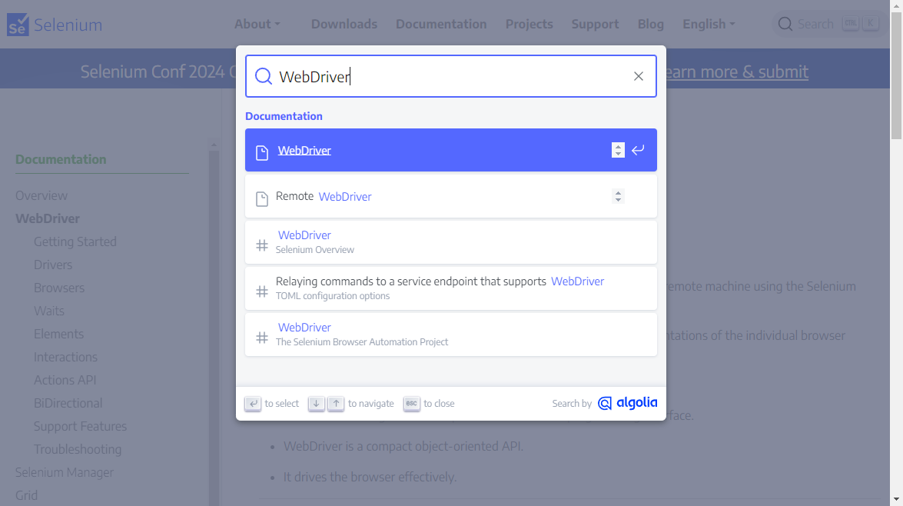

# Sample.xlsm

&nbsp;&nbsp; **sample.xlsm** は、 VBA の [Selenium](https://www.selenium.dev/ja/documentation/) バインディングである [SeleniumVBA](https://github.com/GCuser99/SeleniumVBA) を用いて web スクレイピングを行うための VBA を含む Microsoft Excel オブジェクトであり、

* Thisworkbook
* configure
* proxySettengs
* Sheet1

のモジュールで構成される。

## Thisworkbook

&nbsp;&nbsp; 起動時に以下の処理を行う。

* SeleniumVBA.xlam のアドイン
* プロキシサーバーにログインするための拡張機能のインストール
* Chrome のバージョンに適合する WebDriver のインストール
* 最新の SeleniumVBA のインストール
* 実行時バインディングのためのパブリック・メソッド Create_Object 定義

## configure

&nbsp;&nbsp; 非表示のシート・モジュールで、パブリック・プロパティ―として下記を収録

* driverPath ： WebDriver のパス
* addin_Path ： SeleniumVBA.xlam のパス
* version    ： SeleniumVBA.xlam のバージョン
* extension  ： 拡張機能の収録フォルダー

## proxySettengs

&nbsp;&nbsp; プロキシサーバー経由でインターネットにアクセスする場合のサーバー情報・認証情報を入力するためのフォーム・モジュール。
HTTP_PROXY 環境変数が設定されている場合は不使用。

## Sheet1

&nbsp;&nbsp; web ページの遷移を行う簡単なサンプル。


### コード

```basic
 1	Private Sub CommandButton1_Click()
 2	
 3	    Dim driver As Object
 4	    Dim caps As Object
 5	    Dim keys As Object
 6	
 7	    Set driver = ThisWorkbook.Create_Object("WebDriver")
 8	    driver.StartChrome configure.driverPath
 9
10	    If ThisWorkbook.use_proxy Then
11	        Set caps = driver.CreateCapabilities
12	        caps.AddArguments "--load-extension=" & configure.extension
13	        driver.OpenBrowser caps
14	    Else
15	        driver.OpenBrowser
16	    End If
17	
18	    driver.NavigateTo "https://www.selenium.dev"
19	    driver.Wait 1000
20	
21	    driver.FindElementByClassName("DocSearch-Button").Click
22	    driver.Wait 1000
23
24	    Set keys = ThisWorkbook.Create_Object("WebKeyboard")
25	    driver.GetActiveElement().SendKeys "Getting started"
26	    driver.Wait
27	    driver.GetActiveElement().SendKeys keys.EnterKey
28	    driver.Wait 5000
29	
30	    driver.CloseBrowser
31	    driver.Shutdown
32	
33	End Sub
```

### 解&nbsp;&nbsp;説

**7 行目**&nbsp;&nbsp; WebDriver クラスのインスタンスを生成。<br>
**8 行目**&nbsp;&nbsp; configure.driverPath にある実行可能ファイルを WebDriver クラスにバインドして起動。<br>
**10 - 16 行**&nbsp;&nbsp; プロキシサーバー経由でインターネットにアクセスする場合に拡張機能を用いてログインするように設定。<br>
**18 - 19 行**&nbsp;&nbsp; [Selenium のホームページ](https://www.selenium.dev)に遷移。<br>


**21 - 22 行**&nbsp;&nbsp; 検索ボタン（クラス名：DocSearch-Button）をクリック。<br>
**24 - 26 行**&nbsp;&nbsp; テキストボックスに「Getting started」を送信。<br>



**27 - 28 行**&nbsp;&nbsp; Enter キー（WebKeyboad クラスのメソッド）を送信して[遷移するページ](https://www.selenium.dev/documentation/webdriver/getting_started/)を確定。 <br>


**30 - 31 行**&nbsp;&nbsp; 後処理

### 捕&nbsp;&nbsp;捉

* 19 行目までと 30 行目以降は実行するケースによらす同様となる
* これ以外はアクセスする web ページにより千差万別なので、ページの構造を理解したうえでコーディングを行う。意図する操作を反映するためにはテストを繰り返すことになる。
* コーディングに当っては下記が参考となる。<br>
&nbsp;&nbsp;&nbsp;&nbsp;https://github.com/GCuser99/SeleniumVBA/wiki/Object-Model-Overview <br>
&nbsp;&nbsp;&nbsp;&nbsp;https://github.com/GCuser99/SeleniumVBA/wiki

## トラブルシュート

&nbsp;&nbsp; 起動時に「実行時エラー '6068': Visual Basic Project へのプログラム的なアクセスは信頼されません。」と表示される場合は、以下の手順でアクセスを明示的に許可する必要がある。


