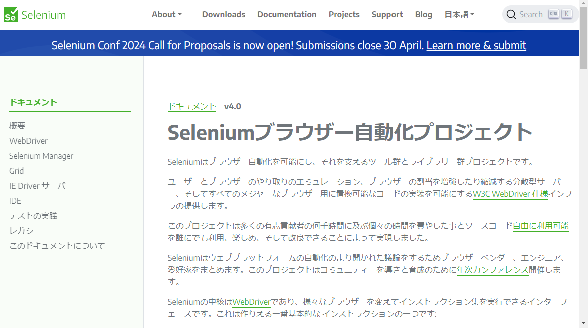

# Sample.xlsm

&nbsp;&nbsp; **sample.xlsm** は [SeleniumVBA](https://github.com/GCuser99/SeleniumVBA) を用いて web スクレイピングを行うための Microsoft Excel オブジェクトであり、

* [Thisworkbook](#thisworkbook)
* [configure](#configure)
* [sample](#sample)

のモジュールで構成される。

## Thisworkbook

&nbsp;&nbsp; 起動時に以下の処理を行う。
<span style="color:red">web ブラウザは Google Chrome に限定している。</span>
起動に失敗する場合は[こちら](#トラブルシュート)を確認されたい。

* 最新の WebDriver（SeleniumVBA）のインストーラのダウンロード
* Browser（Google Chrome）のバージョンに適合する Driver のインストール
* SeleniumVBA の参照設定


## configure

&nbsp;&nbsp; 非表示のシート・モジュールでパブリック・プロパティ―として下記を保有

* driverPath     ： WebDriver のパス
* libraryPath    ： SeleniumVBA のパス
* libraryVersion ： SeleniumVBA のバージョン

## sample

&nbsp;&nbsp; web ページの遷移を行う簡単なサンプル。


### コード

```basic
 1	Option Explicit
 2	
 3	Private Sub CommandButton1_Click()
 4	
 5	    Dim keys As New SeleniumVBA.WebKeyboard
 6	
 7	    With New SeleniumVBA.WebDriver
 8	        .StartChrome configure.driverPath
 9	        .OpenBrowser
10	        
11	        .NavigateTo "https://www.selenium.dev/ja/documentation/"
12	        .Wait 1000 ' for demonstration
13	
14	        ' Open seach box
15	        .GetActiveElement().SendKeys keys.ctrlKey & "k"
16	        .Wait 1000
17	    
18	        .GetActiveElement().SendKeys "WebDriver"
19	        .Wait 1000
20	    
21	        .GetActiveElement().SendKeys keys.EnterKey
22	        .Wait 1000
23	    
24	        .CloseBrowser
25	        .Shutdown
26	    End With
27	
28	    Set keys = Nothing
29	
30	End Sub
```

### 解&nbsp;&nbsp;説

**5 行目**&nbsp;&nbsp; WebKeyboard クラスのインスタンスを生成<br>
**7 行目**&nbsp;&nbsp; configure.driverPath にある ChromeWebDriver を起動<br>
**10 行**&nbsp;&nbsp; [Selenium 紹介ページ](https://www.selenium.dev/ja/documentation/)に遷移。<br>



**15 行**&nbsp;&nbsp; 検索ボックスを表示。<br>
**18 行**&nbsp;&nbsp; 検索ボックスに「WebDriver」を送信。<br>


**21 行**&nbsp;&nbsp; Enter キーを送信して[遷移するページ](https://www.selenium.dev/documentation/webdriver/)を確定。 <br>


**24 行-**&nbsp;&nbsp; 後処理

### 捕&nbsp;&nbsp;捉

* 9 行目までと 24 行目以降は実行するケースによらす同様となる
* これ以外はアクセスする web ページにより千差万別なので、ページの構造を理解したうえでコーディングを行う。意図する操作を反映するためにはテストを繰り返すことになる。
* コーディングに当っては下記が参考となる。<br>
&nbsp;&nbsp;&nbsp;&nbsp;https://github.com/GCuser99/SeleniumVBA/wiki/Object-Model-Overview <br>
&nbsp;&nbsp;&nbsp;&nbsp;https://github.com/GCuser99/SeleniumVBA/wiki

## トラブルシュート

##### 「実行時エラー '6068': Visual Basic Project へのプログラム的なアクセスは信頼されません。」と表示される
&nbsp;&nbsp; 以下の手順でアクセスを明示的に許可する必要がある。


